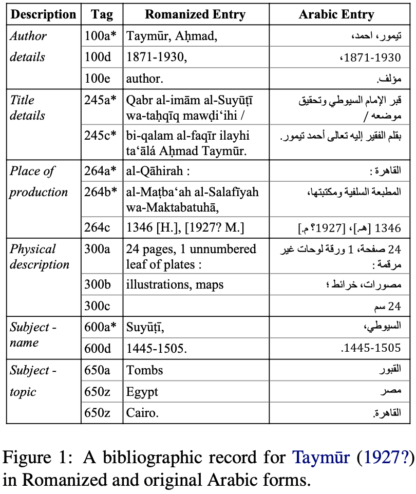

# Arabic ALA-LC Romanization Tool

A tool and dataset for the automatic Romanization of Arabic text in the ALA-LC Romanization standard.

Example of Arabic source and target Romanization with MARC field/subfield tag and tag description (see [publication](https://arxiv.org/pdf/2103.07199.pdf) for more details).

Source: Arabic Collections Online: http://hdl.handle.net/2333.1/m37pvs4b

## Publication

- Eryani, Fadhl & Nizar Habash.  [Automatic Romanization of Arabic Bibliographic Records.](https://arxiv.org/pdf/2103.07199.pdf) Proceedings of the Sixth Arabic Natural Language Processing Workshop. 2021 (pre-print).

## Demo

<romanize-arabic.camel-lab.com>

An online demo of our MLE Simple model 

## Authors

- [Fadhl Eryani](https://github.com/fadhleryani/)
- Nizar Habash

## Setup

### Basic dependencies
This project was developed using python 3.6, and tested in macOS and linux environments.  First you must install required packages:
> pip3 install -r requirements.txt

### MADAMIRA

To run the MADAMIRA morphological analyser and disambiguator, you must have a MADAMIRA distribution in the project directory, which you can obtain from [here](http://innovation.columbia.edu/technologies/cu14012_arabic-language-disambiguation-for-natural-language-processing-applications).

The database used is almor-msa-s31.db (see `documentation/MADAMIRA-UserManual` p6 for more info).  If you have access to this database, place the database file inside `MADAMIRA/resources/` and setup the MADAMIRA config file located in `MADAMIRA/config/almor.properties` by updating the following flag:
> `ALMOR.text.MSA.database.name=almor-s31.db`

For info on the Buckwalter Part-of-Speech tag set used by MADAMIRA, see `/documentation/ATB-POSGuidelines-v3.7.pdf`

#### MADAMIRA and Java requirements
- MADAMIRA will not run on versions of Java above 9
- We used openjdk64-1.8.0.272.  You can install it using `brew install --cask adoptopenjdk8`, or download from the website: https://adoptopenjdk.net/ (make sure to select jdk8)
- We recommend you setup java using [JENV](https://www.jenv.be/)

### Seq2Seq

To run the Seq2Seq model, you must obtain a copy of Shazal & Usman's [Seq2Seq Transliteration Tool](https://github.com/alishazal/seq2seq-transliteration-tool).

> git clone https://github.com/alishazal/seq2seq-transliteration-tool.git seq2seq

We ran our seq2seq systems with the GPU NVIDIA Tesla V100 PCIe 32 GB on NYU Abu Dhabi's High Performance Computing cluster, known as Dalma. We set the memory flag to 30GB. The .sh scripts that we ran can be found in the folders `/src/train/seq2seq_scripts/` and `/src/predict/seq2seq_scripts`.

## Data

Data for this project came from publicly available catalog databases stored in the [MARC (machine-readable cataloging) standard](https://www.loc.gov/marc/bibliographic/) xml format.  If you are only interested in replicating our experimental setup, you can skip this section as you only need the tsvs provided in data.zip under `data/processed` (see release files).  Read on for details on downloading the original marcxml dumps, collecting Arabic records, preprocessing and splits.

### Downloading Data

Catalog data in MARC xml format were downloaded from the following sources.  To re-download the sources used in this project, simply run `make download_data`, or run each of the following commands:

Arabic Collections Online (ACO):
> git clone https://github.com/NYULibraries/aco-karms/ data/raw_records/aco/

Library of Congress (LOC): 
> for val in {01..43}; do wget -nc -P data/raw_records/loc https://www.loc.gov/cds/downloads/MDSConnect/BooksAll.2016.part$$val.xml.gz; done 
> gunzip data/raw_records/loc/*

University of Michigan (UMICH):
> wget -nc -P data/raw_records/umich http://www.lib.umich.edu/files/umich_bib.xml.gz 
> gunzip data/raw_records/umich/*

or simply run `make download_data`

### Collecting Arabic Records

The first step is to read our MARC records from each data source and collect records tagged as Arabic into new marcxml collections.

UMICH and LOC are comprised of large marcxml collections containing thousands of records per file.

> python3 src/data/collect_arabic_records.py data/raw_records/umich

> python3 src/data/collect_arabic_records.py data/raw_records/loc

ACO records are in a parent folder named `aco/work` with thousands of individual xml files containing a single record each.  Furthermore, each of ACO's partner institutions places their records inside a subfolder named `marcxml_out`, which we specify with `--sub_directory_filter`

> python3 src/data/collect_arabic_records.py data/raw_records/aco/work --sub_directory_filter marcxml_out

### Extract parallel lines

Once the Arabic marcxml collections are created, you can parse them and extract parallel Arabic and Romanized entries into a single tsv by running the following command:

> python3 src/loc_transcribe.py extract data/arabic_records/ data/extracted_lines/extracted_lines.tsv

or simply run `make extract_lines`

### Clean, preprocess, and split

Finally, we cleanup `data/extracted_lines/extracted_lines.tsv` and split records into Train, Dev, and Test sets.

> python3 src/loc_transcribe.py preprocess data/extracted_lines/extracted_lines.tsv data/processed/ --split

or simply run `make data_set`

## Running Arabic ALA-LC Romanization models

This section describes how to run the various prediction models we report on in [publication](#publication).
By default, predictions are run on the dev set, but you can replace the `dev` argument with `test` or a path to any tsv file containing an input column labelled `ar`.

### 1. Rules Simple

The baseline model Romanizes any input Arabic text based on 
- the regex rules mapped in `src/predict/ar2phon/ar2phon_map.tsv`
- exceptional spellings mapped in `src/predict/ar2phon/loc_exceptional_spellings.tsv`.

> python3 src/loc_transcribe.py predict simple dev

### 2. Rules Morph

This model first runs MADAMIRA on the Arabic input and Romanizes the diacritized and segmented MADAMIRA output.

> python3 src/loc_transcribe.py predict morph dev 

### 3. MLE

#### Train

The `--size` flag is used to specify the proportion of training data to use from the Train set.  The following command will generate the 7 differently sized models we report on for **MLE Simple**. 

> python3 src/loc_transcribe.py train mle --size 1, 0.5, 0.25, 0.125, 0.0625, 0.03125, 0.015625

#### Predict **MLE Simple** and **MLE Morph**

This will predict the dev set using the model trained on the full Training set.

- MLE Simple
> python3 src/loc_transcribe.py predict mle dev --mle_model models/mle/size1.0.tsv --backoff predictions_out/simple/dev/simple.out

- MLE Morph
> python3 src/loc_transcribe.py predict mle dev -m models/mle/size1.0.tsv -b predictions_out/morph/dev/morph.out

To generate predictions for all model sizes we report on, simply run `make predict_mle`

### 4. Seq2Seq

As mentioned, we ran the Seq2Seq model in Dalma.

#### Prep data

This command will prepare the intermediate files and Dalma scripts required for training the 7 differently sized Seq2Seq models.

> python3 src/loc_transcribe.py train seq2seq --prep --size 1.0, 0.5, 0.25, 0.125, 0.0625, 0.03125, 0.015625

or simply run `make prep_seq2seq`

#### Train Seq2Seq and predict dev 

This command will 1) train Seq2Seq models using the specified portions of the Train set and 2) predict Dev using the specified models.

> python3 src/loc_transcribe.py train seq2seq --train --size 1.0, 0.5, 0.25, 0.125, 0.0625, 0.03125, 0.015625

#### Predict test

This command generates predictions for the test set using the full Train model.

> python3 src/loc_transcribe.py predict seq2seq --predict_test -s 1.0

### 5. Seq2Seq aligned

To align Seq2Seq predictions and fill missing output using **MLE Morph**, we can run the following command:

> python3 src/loc_transcribe.py predict seq2seq --align_backoff predictions_out/seq2seq/dev/seq2seq_size1.0.out predictions_out/mle_morph/dev/mle_morph_size1.0.out 

or run `make align_seq2seq` and `make align_seq2seq_test` to replicate the predictions we report on.

## Evaluation

- Evaluate the dev predictions of (Seq2Seq aligned with Mle Morph)
> python3 src/loc_transcribe.py evaluate predictions_out/aligned_seq2seq/dev/seq2seq_size1.0Xmle_morph_size1.0.out data/processed/dev.tsv 

- Evaluate the test predictions of (Seq2Seq aligned with Mle Morph)
> python3 src/loc_transcribe.py evaluate predictions_out/aligned_seq2seq/test/seq2seq_size1.0Xmle_morph_size1.0.out data/processed/test.tsv 

or run `make evaluate` to evaluate all models we report on.

## Print Evaluation Scores

To retrieve scores for all evaluated models (contained in `evaluation/`), run the following:

> python3 src/loc_transcribe.py score all

or specify the evaluated files you want to retrieve scores for, e.g.:

> python3 src/loc_transcribe.py score evaluation/dev/mle_morph_size1.0.tsv evaluation/dev/simple.tsv 

